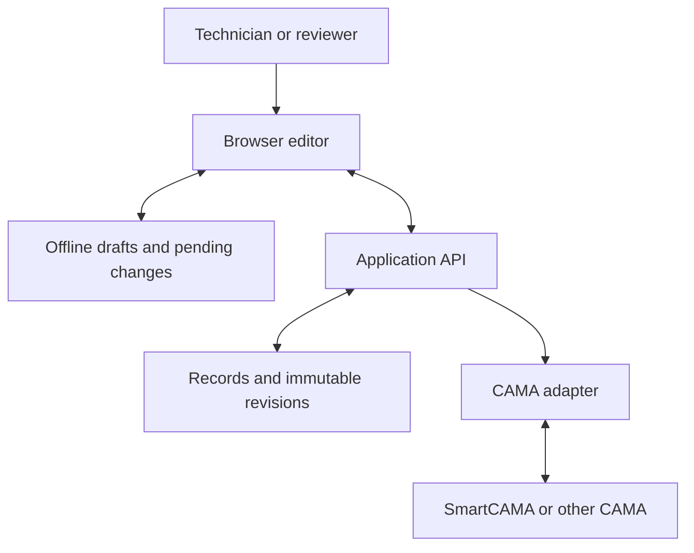

# Proposed architecture

Status: design proposal. Exact libraries, versions, identity provider, and hosting are implementation decisions that must be recorded before use.

## Components

- React and TypeScript browser editor, initially using SVG for geometry and dimensions.
- Independent geometry package shared by the editor and server validation. Geometry is stored in real-world units, separate from display pixels.
- TypeScript application API for access, records, revision approval, exports, and adapter jobs.
- PostgreSQL for organizations, parcel/building identity, revision metadata, audit events, rules, and export receipts. Versioned geometry documents may use JSONB alongside relational identifiers.
- Object storage for original import files, photos, and reports.
- CAMA adapters that map each system's identifiers and classification codes to the canonical sketch model.

## Data flow

The browser and API use the same versioned geometry rules. Reports and CAMA outputs must refer to the exact approved revision and calculation version.

## Core invariants

- Preserve entered measurements, units, original text, and provenance.
- Separate gross geometry, deductions, net area, reporting classifications, and assessment factors.
- Give areas explicit parent, floor, and relationship identifiers. Do not infer assessment treatment from fill color.
- Do not double-count shared or overlapping spaces. Validate geometry before calculating official totals.
- Approved revisions are immutable. Editing an approved record starts another revision.
- Local coordinates are distinct from future map coordinates and calibration information.

## Offline and concurrent edits

Cache application resources with a service worker and store downloaded jobs/drafts in IndexedDB. Indicate local-save and server-sync status separately. Use base-revision checks; preserve competing drafts and expose a resolution workflow instead of silently overwriting geometry. Test storage eviction, browser restarts, app updates, authentication expiry, and reconnection on the selected field devices.

## CAMA exchange

Validate organization, user, parcel, building, year, and authorization for each launch. Approved exports contain version identity, geometry, area classifications, units, gross/net totals, report references, and approval metadata. Use authenticated exchanges, idempotency keys, optimistic concurrency checks, retryable jobs, and acknowledgments. A test receiver comes before any live write.

## Organization boundaries

Enforce tenant access at the API and database. PostgreSQL row security can reinforce isolation when the application role cannot bypass it. Apply the same boundary to reports, original files, batch exports, and background jobs. Use established organization sign-in and explicit technician/reviewer/administrator roles. Verify backups and restoration before a live pilot.

## Scope of the first implementation

Start with the schema, engine, and editable sketch. Keep CAMA coupling, source-file decoding, and AI outside the engine. AI may later propose validated edits; user confirmation and deterministic geometry remain authoritative.

Technical references and competitive sources are listed in [the product plan](product-plan.md#sources-and-validation-basis).
